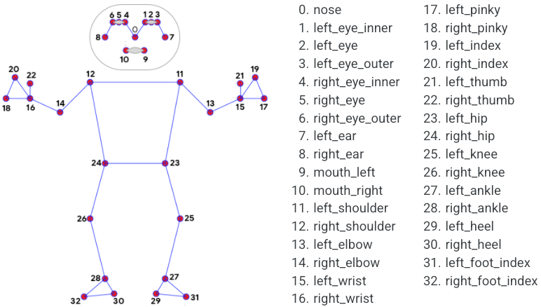

# Humandroid body pose

The goal of this project is to have a REAL humanoid robot imitate the movements of a human.

The example below shows a humandroid [robot](https://www.elettraroboticslab.it/progetti/Galvan) following me in real time, controlled by my computer with MediaPipe.


This program use [MediaPipe](https://mediapipe.dev) to detect the body pose.<br>
MediaPipe Pose is a ML solution for high-fidelity body pose, 
inferring 33 2D landmarks on the whole body.
The detector that MediaPipe uses is inspired by [BlazeFace](https://arxiv.org/abs/1907.05047).



## How it works

This program contains a Humandroid class, which takes care of all image processing operations, using MediaPipe.
The Humandroid class contains various methods that perform operations/calculations on the image. 
The results are always accessible from the main program and can be exported, in JSON format, 
to communicate with other systems and control a humanoid robot.

In the example above red labels represent the angles that servomotors of a humanoid robot must assume.

JSON data representation example: (only 1 landmark)
```
{
    "pose_landmarks": [
        {
            "id": 13,
            "name": "PoseLandmark.LEFT_ELBOW",
            "x": 0.7578693628311157,
            "y": 1.1605275869369507,
            "z": -0.3892576992511749,
            "visibility": 0.8600940108299255,
            "angle": 52,
            "z_angle": 5
        }
    ]
}
```

## Core
The core of this project is [SimplePYBotSDK](https://github.com/vellons/SimplePYBotSDK), a simple Python3 library to manage the states of servomotors and sensor in a robot, in a very simple way.
I've built this library to handle the status of robot’s motors.

Every robot design is defined in a JSON file, in which all robot specifications are set. 
In these files we can find: robot basic information, servomotors list (with angle limits, offset, orientation), sensors, motors type, and standard poses for the robot.
The core of SimplePYBotSDK allows you to move servomotor (changing the state) or group of servomotors simply with a method invocation. 
The core handles the movements with the right speed (defined in the file configuration).

The library was built to be completely independent from the robot hardware and extremely simple to use. Direct control of the motors can be managed externally to the library and can be different for each robot.

### Socket layer
To enable a low latency real time communication an external layer has been added to the library, to allow socket management. 
This can be used in robot cooperation or to [debug our robots in real time](https://github.com/vellons/SimplePYBotDashboard).

Sockets can also be used to integrate the robot with externals programs in a simple way.
We used this to tests our programs in a simulated environment, using Webots.

In my case the computer is sending all the data to a Raspberry Pi zero W using a socket.


## Project setup

#### Create a virtual environment
```
python3 -m venv env
```

#### Activate virtual environment
```
source env/bin/activate # On Linux
env\Scripts\activate # On Windows
```

#### Install all requirements inside it
```
pip install -r requirements.txt
```

#### Build a robot
[https://www.elettraroboticslab.it](https://www.elettraroboticslab.it)

#### Run
```shell
python3 main.py
```
